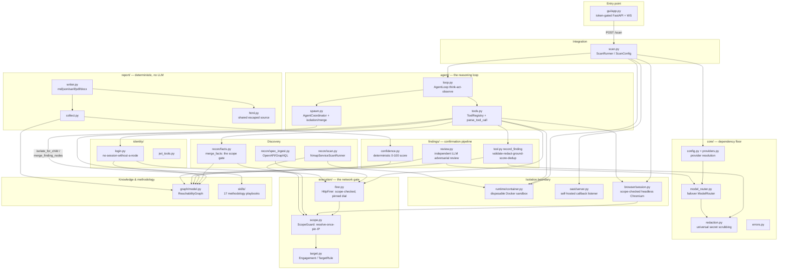
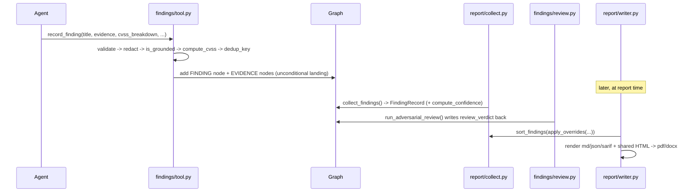

# L4L0 — Codebase Map

> Auto-generated by Cartographer. Last mapped: 2026-09-05T15:35:30Z

All 19 phases (0–18) of the governing plan plus the end-to-end integration
pass are complete on branch `project-lalo`. This replaces the earlier
placeholder map ("rebuild in progress").

## System Overview



## Directory Structure

```
src/lalo/
├── scan.py            # THE integration module — ScanRunner/ScanConfig
├── agent/             # think-act-observe loop, multi-agent spawn, tool registry
├── browser/           # scope-checked headless Chromium tool
├── core/               # config/providers/router/errors/redaction/logging — dependency floor
├── eval/               # benchmark cases, recall/precision scoring, lab-target ground truth
├── execution/          # Engagement/ScopeGuard/HttpFirer/rawsock — the network gate
├── findings/           # record_finding pipeline: validate→redact→ground→CVSS→dedup→confirm
├── graph/              # ReachabilityGraph (networkx-backed), query_graph/note tools
├── gui/                # FastAPI app, cursor-resumable WebSocket, static SPA — the only entry point
├── identity/           # per-identity credentials, login, JWT tamper, role matrix
├── integrations/       # external MCP client, EPSS lookup
├── oast/               # self-hosted HTTP+DNS callback listener
├── observability/      # lightweight span/counter tracing
├── orchestrator/       # Budget (graduated bands), DurableJournal (crash-safe resume), scheduler
├── payloads/           # pure string mutations (url/unicode/html-entity encode) — no corpus, no judgment
├── prompts/            # per-role system prompt templates, schema-validated, operator-overridable
├── recon/              # ReconFact/merge_facts gate, spec ingestion, JS mining, nmap runner
├── report/             # deterministic md/json/sarif/pdf/docx rendering — never an LLM call
├── runtime/            # RuntimeContainer — the disposable, host-isolated sandbox
└── skills/             # 17 markdown methodology playbooks + loader/recall/tool
```

## Module Guide

### `core/` — the dependency floor

**Purpose**: Provider/config resolution, the multi-provider failover router, the typed error
hierarchy, and the one universal secret-redaction module. Nothing else in the tree has a
dependency-free base except this package (`config.py` has zero `lalo` imports).

**Key files**:
| File | Purpose |
|------|---------|
| `config.py` | `CURATED_PROVIDERS` table + `load_settings()` — env-based credential resolution, `LALO_MODEL=<provider>:<model>` override |
| `providers.py` | `AnthropicProvider` + one generic `OpenAICompatibleProvider` (serves OpenAI/Gemini/local-gateway/custom) + `build_router()` |
| `model_router.py` | `ModelRouter` — role→provider-chain failover; only `ProviderRefusalError`/`ProviderUnavailableError` trigger failover |
| `redaction.py` | `SecretRedactor` — pattern + entropy + exact-match, longest-secret-first substitution; `redact()`, `safe_target_url()` |
| `errors.py` | `LaloError` hierarchy, each with a stable `.code` |
| `atomic_io.py` | `atomic_write_verified()` — write→fsync→read-back-compare→`os.replace` |
| `logging.py` | `get_logger()` — every line passes through `RedactingFormatter` |

**Exports consumed everywhere**: `get_logger`, `redact`/`safe_target_url`, the `LaloError` subclasses,
`ModelRouter`/`CompletionRequest`, `build_router`.

**Gotchas**:
- `custom` provider has no default model — an empty default would "succeed" config resolution and
  then fail every real request, so its model env var is mandatory via `extra_required_envs`.
- `ModelRouter.chain_for()` distinguishes "role not configured" (falls back to `default_route`) from
  "role mapped to an explicit empty tuple" (stays disabled) — `.get(role) or default` would collapse
  that distinction since an empty tuple is falsy.
- Exact secrets are redacted **longest-first** — plain iteration order could let a short registered
  secret's replacement mangle a longer secret that contains it as a substring.
- `_RETRYABLE_STATUS` includes any `>= 400`, so even a non-retryable 401/403 currently fails over to
  the next provider rather than aborting immediately.

### `agent/` — the reasoning loop

**Purpose**: The autonomous think→act→observe driver, multi-agent spawn/isolation/merge, and the
tool-calling primitives every tool builder in the codebase implements.

**Key files**:
| File | Purpose |
|------|---------|
| `loop.py` | `AgentLoop.run(mission)` — one tool call per turn, budget-band directives, repeat-call dedup/abort, a reserved final turn beyond `max_steps` |
| `spawn.py` | `AgentCoordinator` (depth-ceiling spawn tree), `isolate_for_child` (graph `snapshot()`), `merge_finding_nodes` (authoritative-only merge), `build_spawn_tools` |
| `tools.py` | `Tool` protocol, `FunctionTool`, `ToolRegistry`, `parse_tool_call` (tolerant JSON extraction), `str_arg` |

**Data flow**: mission + `registry.describe()` + budget directive + last 12 transcript entries →
`router.complete()` → `parse_tool_call` (first valid call only, extras logged not silently dropped) →
`registry.dispatch()` → observation appended, budget spent, trace counter incremented → repeat.

**Gotchas**:
- `repeat_soft_threshold` must be `>= 2` (enforced in `__post_init__`) — `repeat_count` starts at 1 for
  a brand-new call signature, so a threshold of 1 would treat a tool's genuinely first call as already
  repeated.
- A repeated call at `repeat_soft_threshold` is **not re-executed** (avoids repeating a side effect)
  but still counts toward transcript/budget spend.
- `str_arg` treats an explicit JSON `null` the same as a missing key — `args.get(key, default)` alone
  returns the literal string `"None"` for an explicit null, which silently passes an `if not value` check.
- `spawn.py`'s spawn model is **synchronous** (parent blocks on child) — deliberately not the
  concurrent mailbox model every studied reference implements. This is why `browser/session.py` and
  the container/OAST server are each shared once per scan rather than duplicated per agent: there is
  never concurrent tool dispatch to isolate against.
- `merge_finding_nodes` is first-writer-wins and copies only nodes the child actually has — a claimed
  finding id absent from the child's own graph is silently skipped, never fabricated on the parent.

### `execution/` — the network gate

**Purpose**: The layered scope-enforcement chain every structured (non-free-shell) network action
passes through, before any I/O.

**Key files**:
| File | Purpose |
|------|---------|
| `target.py` | `Engagement`/`TargetRule` — the operator-declared allowlist (glob host + optional port/scheme), `from_specs()` parses multiple spec shapes |
| `scope.py` | `ScopeGuard.check()` — resolve-once-pin-IP DNS-rebinding defense, metadata denial, `tcp://` scheme support for raw-TCP |
| `firer.py` | `HttpFirer` — checks scope before any I/O, dials the pinned IP, manual redirect-following re-checks scope per hop, per-host circuit breaker |
| `rawsock.py` | `tcp_send_recv()` — the same pinned-dial discipline extended to raw TCP |
| `tool.py` | `build_http_tool()` — the agent-facing `http` tool |

**Chain**: `Engagement` (data) → `ScopeGuard.check()` (the authority, called by every consumer below)
→ `HttpFirer.fire()` (dials the *same* pinned IP the check resolved) → `fire_redirects()` (each hop
re-enters `fire()`, so redirects can't bypass scope). `recon/scan.py`'s nmap runner and
`browser/session.py`'s Chromium navigation both reuse this identical `ScopeGuard`.

**Gotchas**:
- A URL with no explicit port is checked against the scheme's *default* port, never `None` — otherwise
  a port-restricted rule is silently bypassed by omitting the port.
- `tcp://` is engagement-checked but not restricted to the `http`/`https` scheme allowlist — a
  deliberate carve-out for the raw-TCP path.
- `httpx.InvalidURL` is not an `HTTPError` subclass and needs its own except clause.
- The free shell (`run_command`) is **not** routed through this layer at all — it relies on the
  container boundary (`runtime/`), not `ScopeGuard`; it is "prompt-scoped," a materially weaker
  guarantee by design (freedom inside the container, isolation is that nothing escapes it).

### `graph/` — the shared knowledge store

**Purpose**: `ReachabilityGraph`, a thin typed wrapper over one `networkx.MultiDiGraph`, holding
everything a scan learns (endpoints, identities, sessions, findings, evidence, notes) plus multi-step
attack-chain solving.

**Key file**: `model.py` — `NodeKind` (ENDPOINT/PARAM/IDENTITY/SESSION/FINDING/EVIDENCE/FINGERPRINT/
SERVICE/NOTE), `EdgeKind` (HAS_PARAM/AUTHENTICATED_AS/SUPPORTS/ENABLES/EXPOSES/FINGERPRINTED_AS),
`snapshot()` (deep-copy isolation — the `Isolatable` seam `agent/spawn.py` depends on), `find_chains()`
(multi-step `ENABLES`-edge path solver), `save`/`load` (atomic, byte-verified).

`tool.py` adds `query_graph` (read-only by construction — only ever calls `.node()`/`.nodes_of_kind()`)
and `note` (a freeform scratchpad reusing `NodeKind.NOTE`).

**Gotchas**:
- `find_chains` re-adds every original node to its filtered edge-kind view before pathfinding, so a
  node with zero edges of that kind doesn't vanish and crash on an unreachable source/target.
- `nx.all_simple_paths` is a generator — `NodeNotFound` only raises once iterated, so the list
  comprehension must be *inside* the try block.
- Parallel `ENABLES` edges between the same node pair (two agents each recording their own edge for
  the same relationship) are deduplicated to one real chain, not one per edge.
- Only `save()` gets crash-safety/byte-verification; `load()` is a plain `read_bytes()`.

### `findings/` — the confirmation pipeline (CLAUDE.md's two non-blocking layers)

**Purpose**: `record_finding` lands a finding unconditionally the moment required fields are present;
confidence and adversarial review are both strictly additive, never gating.

**Pipeline**:
1. **`tool.py`'s `record_finding`** — `validate_finding_fields` (model.py, a *shape* gate only, never a
   truth judgment) → `target` redacted via URL-aware `safe_target_url` **before** anything derives from
   it (dedup key, graph node, observation, later the reviewer's prompt) → `is_grounded()` (grounding.py,
   whitespace-normalized substring check — extended from CRLF-only after a real live run's false
   negative) → `compute_cvss()` (cvss.py, real `cvss` library from an 8-metric breakdown) →
   `dedup_key()`/`find_duplicate()` (dedup.py, JSON-encoded triple avoids delimiter collision) → lands
   as a new `FINDING` node + one `EVIDENCE` node per blob, or merges into an existing dedup match.
2. **`confidence.py`'s `compute_confidence`** — six independently-capped weighted components (evidence
   provenance 25, reproducibility 20, corroboration 20, specificity 15, cross-context 10, chained-impact
   10) summed to 0–100; an unmet component zeroes its points and appends a flag, never drops the finding.
3. **`review.py`'s `run_adversarial_review`** — an independent LLM call shown *only* the bare
   vuln_class/target/param/evidence/cvss_severity (never the finder's own description/counterevidence,
   to avoid bias), returning `confirmed`/`ruled_out`/`open_proof_gap` with a fixed score delta
   (+10/−50/−20). This is the **only** place in the codebase that writes `review_verdict`/
   `review_proof_level`/`review_reasoning` onto a graph node.

**Gotchas**:
- A dedup-hit merge unions evidence/identities/`reproduced`/`evidence_grounded` into the existing node
  but does **not** recompute CVSS or re-check grounding of the merged pool.
- `run_adversarial_review` never raises — a total provider failure or unparseable response both
  degrade to `open_proof_gap` at the unadjusted score.
- `report/collect.py`'s `review_verdict`/`review_proof_level` fields stay `None` until this function
  has actually run once for that finding — never a fabricated "not reviewed" state.

### `report/` — deterministic output, never an LLM call

**Purpose**: Read-only, pure transforms from the graph into five parallel formats.

**Pipeline**: `collect.py`'s `collect_findings(graph)` (computes confidence fresh, reads back whatever
`review_verdict` is already on the node) → `sort_findings` (severity via `effective_severity`, which
prefers an operator `display_severity` override) → `coverage.py`'s `build_coverage_summary` ("not
assessed" is honestly ambiguous between "tested clean" and "never looked at," by design) →
`writer.py`'s `write_report()` assembles Markdown + JSON + SARIF directly, and one shared, fully
HTML-escaped intermediate (`html.py`) that both `pdf.py` (WeasyPrint, external resource fetching
hard-disabled as defense-in-depth) and `docx.py` (`html2docx`) render from — PDF/DOCX are never
independently re-derived from the graph.

**Gotchas**:
- `markdown.py`'s `safe_fence()` computes a backtick fence one char longer than the longest run already
  in the content — a from-scratch character-scan reimplementation, not a port of the regex-based idea
  it was informed by.
- `sarif.py`'s `_security_severity()` deliberately avoids a truthy check on `cvss_score` — a genuine
  `0.0` score is legitimate and a naive `score or default` would silently discard it.
- `overrides.py` never mutates the underlying graph node — only the report-facing `display_severity`
  changes; reading the finding directly off the graph still shows the original computed severity.
- `writer.py`'s docstring names an accepted, un-closed gap: each of the 5 files is individually atomic
  and byte-verified, but the 5-file write is not one multi-file transaction.

### `runtime/` — the host-isolation boundary

**Purpose**: `RuntimeContainer` — the disposable per-scan container the free shell (`run_command`) is
the *only* point of contact with.

**Key file**: `container.py` — `--cap-drop ALL` + a narrow `--cap-add` allowlist with hard-forbidden
caps (`SYS_ADMIN`/`SYS_MODULE`/`SYS_RAWIO`/`SYS_BOOT`) **enforced** at construction time, not just
documented; no bind-mounts, no Docker socket, ever; a liveness check immediately after `start()` with
no intervening work, to catch a container that dies within milliseconds.

**Image**: `docker/lalo-runtime.Dockerfile` (built on demand — large, "install everything the agent
might reasonably need" arsenal: Go-based recon tools, feroxbuster, several pipx-installed Python
security tools, standalone SCA/secrets binaries — soft-fails per tool so one broken install doesn't
sink the build).

**Gotchas**:
- `_normalize_cap()` strips the `CAP_` prefix and uppercases before comparing against the forbidden
  set — closes a case/prefix bypass Docker itself would otherwise accept.
- `start()` does best-effort cleanup if the docker CLI call times out client-side, since the daemon may
  have created the container anyway — necessary because `__enter__` raising skips `__exit__` entirely.
- In-container root is fine by design — the isolation guarantee is that nothing escapes the container,
  not that the agent lacks privilege inside it.

### `recon/` — discovery, gated at merge time

**Purpose**: `merge_facts()` (facts.py) is the single gate every discovery producer funnels through —
a fact's own claimed URL can never self-grant scope.

**Producers**: `spec_ingest.py` (OpenAPI/GraphQL, fired through the real `HttpFirer`; endpoint URLs
anchored to where the spec was *actually fetched from*, never its own `servers` field), `js_mining.py`
(pure zero-I/O regex heuristics on already-captured JS — explicitly candidate signal, not confirmed
fact), `scan.py`'s `NmapServiceScanRunner` (a concrete `ReconRunner`, the first one — runs `nmap -sV`
inside the disposable container via the same `CommandExecutor` seam `run_command` uses).

**Orchestration**: `runner.py`'s `run_recon_chain()` — availability-gated, accumulates from *every*
available runner rather than stopping at first success, isolates each runner's crash.

**Single dispatch surface**: `tool.py`'s `recon` tool, dispatch-by-`action`
(`fetch_openapi`/`parse_graphql`/`mine_js`/`scan_ports`).

**Gotchas**:
- `NmapServiceScanRunner` validates `host`/`ports` against a strict allowlist regex, not just
  `shlex.quote` — quoting alone doesn't stop a value like `"--script=vulners"` (no shell metacharacters
  at all) from being parsed as an nmap flag once it lands as a single argv token. Re-validated in both
  `is_available()` and `run()`.
- The nmap scan itself is authorized per-*host*, not per-port — each individual open-port *fact* is
  still independently scope-checked by `merge_facts` afterward, a documented residual gap.

### `identity/` — no session without a graph node

**Purpose**: Per-identity credential store with no shared/global state, multi-scheme login, and a
mechanical invariant with no analog in any studied reference: a session can never be retrieved without
a corresponding node on the graph.

**Key files**: `credentials.py` (`IdentityStore` — every credential auto-registers with the shared
redactor the moment it exists), `login.py` (`SessionRegistry.register()` writes the graph node and
stores the session in the same call; `.get()` re-verifies the node still exists), `jwt_tools.py` (pure
decode/`alg:none`-forge/claim-substitution primitives, never verifies signatures, never decides
anything is vulnerable), `role_matrix.py` (identity × endpoint test-plan generator), `tool.py`
(`login_as` dispatches by name against a pre-registered scheme map — the only agent-facing path to a
session; `jwt` wraps the three tamper primitives behind one dispatch-by-`op` tool).

**Gotcha**: an empty-string session value (e.g. `Set-Cookie: session=;`) is explicitly rejected as a
failed login, not treated as success from a bare `is None` check.

### `browser/` — the last named flat-toolset gap, closed

**Purpose**: A real, scope-checked headless-browser tool. Runs host-side (not inside the disposable
container) — Chromium navigating a scope-checked engagement target is the same risk shape as `httpx`
firing a scope-checked request, not a free-shell-style unrestricted action.

**Key file**: `session.py` — `BrowserSession.navigate()`/`.click()` both check the destination against
the same `ScopeGuard` the `http` tool uses; a click that triggers navigation (a link, a JS redirect) is
re-checked afterward and reverted (`page.go_back()`) if it lands out of scope — the concrete,
code-enforced version of a prompt-only "don't follow a page's own instructions" defense.

**Gotchas**: one shared `BrowserSession` for the whole scan (never one per spawned agent — spawning is
synchronous, so there's no concurrency to isolate against); no pinned-IP-dial DNS-rebinding defense
like the HTTP firer has (Chromium has no simple per-navigation "dial this literal IP" API) — a
documented residual gap, not silently assumed away.

### `skills/` — the actual methodology (not fixed detector code)

**Purpose**: 17 markdown playbooks (2 methodology + 15 vulnerability classes) the agent retrieves via
`recall`, following CLAUDE.md's core design principle that the agent's own reasoning + these playbooks
*is* the methodology, not hardcoded Python detectors.

**Shared structure** (every vulnerability-class file): `Attack Surface` → `Recon` → `Techniques (start
quiet, escalate only as needed)` → `Proof Ladder` → `Validation and False-Positive Discipline` →
`Impact` → `Summary`. Two methodology files (`closure-discipline.md`, `severity-calibration.md`) are
cross-referenced by every vulnerability file rather than repeated per-class.

**Pipeline**: `loader.py` (`load_skills()` — parses frontmatter+body, fails fast on duplicate names) →
`recall.py` (pure retrieval: exact name/keyword match first, then weighted token-overlap; deliberately
no embeddings/vector search — rejected as over-engineering for "a few dozen fixed, hand-curated"
files) → `tool.py` (`build_recall_tool()` — the agent-callable `recall` tool, `_MAX_OBSERVATION_CHARS`
raised from 6000 to 12000 after a real audit found the lower cap was truncating 16/17 skills mid-sentence
inside their own Validation/False-Positive section).

### `orchestrator/` — the crash-safe control plane

**Purpose**: `Budget` (graduated stop bands, root vs. sub-agent thresholds, a real hard ceiling
distinguishable from a clean finish) and `DurableJournal` (append-only, idempotent `run_once(key, fn)`
resume).

**Gotcha**: `Budget`'s sub-agent bands `(0.75, 0.80, 0.85)` are tighter and earlier than the root's
`(0.70, 0.85, 0.95)` specifically to preserve budget for the root's final report; a budget-exhausted run
is **never** reported as a clean `COMPLETED` — a deliberate correction versus a studied reference's
fail-open bug (exits 0 / records "completed" on exhaustion).

### `eval/` — closing the loop against real lab targets

**Purpose**: `BenchmarkCase`/`run_case` scores ground-truth vuln classes against whatever findings
actually landed on a real graph, using `targets.py`'s four named lab targets (VAmPI, crAPI, Juice Shop,
DVWA — ground truth from each target's own public docs, never from a reference agent).

**Gotcha**: `append_composite_history()` is explicitly documented as unsafe against concurrent writers
(no lock) — accepted because eval targets run one at a time by project convention, not fixed.

### `gui/` + `scan.py` — the only entry point

**`scan.py`**'s `ScanRunner` is the integration module: resolves providers → builds `Engagement`/
`ScopeGuard` → hard-requires a working Docker daemon → starts the container/OAST server/browser
session (nested try/finally, guaranteed reverse-order teardown) → a recursive `_build_registry()`
closure gives every agent (root and each spawned child) an identical flat tool registry bound to a
child's own isolated graph snapshot → runs the root `AgentLoop` → runs adversarial review as a distinct
post-pass over every finding → writes the report.

**`gui/app.py`** is the only way to invoke it: a token-gated (always required, `secrets.compare_digest`,
no unauthenticated fallback) FastAPI app; `POST /scan` launches `ScanRunner.run()` on a background
thread (one scan at a time via a single mutable slot); `POST /steer` is read-only by construction (no
reference to any tool registry exists in this module); `GET /ws` is a cursor-resumable WebSocket
(`gui/events.py`'s `EventLog`, a bounded `deque` ring buffer) with meaningful close codes (`4401`
invalid token, `4400` stale cursor).

## Data Flow

### A scan, end to end

```mermaid
sequenceDiagram
    participant Op as Operator (browser)
    participant GUI as gui/app.py
    participant Scan as scan.py ScanRunner
    participant Loop as agent/loop.py AgentLoop
    participant Tools as ToolRegistry
    participant Graph as ReachabilityGraph
    participant Review as findings/review.py

    Op->>GUI: POST /scan {mission, targets}
    GUI->>Scan: ScanRunner(config).run() [background thread]
    Scan->>Scan: load_settings() -> build_router()
    Scan->>Scan: start RuntimeContainer, OASTServer
    Scan->>Loop: AgentLoop(router, registry, system_prompt)
    loop each step
        Loop->>Tools: dispatch(tool, args)
        Tools->>Graph: record_finding / query_graph / note
        Tools-->>Loop: observation
        Loop-->>GUI: on_event -> EventLog.append (streamed over WS)
    end
    Loop-->>Scan: AgentResult(stop_reason, summary)
    Scan->>Review: run_adversarial_review(each finding)
    Review->>Graph: write review_verdict onto the node
    Scan->>Scan: write_report() -> md/json/sarif/pdf/docx
    Scan-->>GUI: ScanOutcome
    GUI-->>Op: scan_completed event over WS
```

### A finding's lifecycle



## Conventions

- **Reference-first, clean-room synthesis.** Every module's docstring cites which of five studied
  reference agents' real source (never just a summary) informed a design decision, what was
  deliberately rejected, and — critically — what's an original L4L0 mechanism because no reference
  does it. No reference-project name appears anywhere except in these citation docstrings.
- **Fail-closed for security decisions, fail-open for connectivity.** `ScopeGuard`, `resolve_credential`
  (mcp_client.py), `check_tool_call` all refuse by default. A dead external integration or unreachable
  optional service degrades to a failed `ToolResult` instead of crashing the run.
- **Never withhold a finding.** Confidence scoring and adversarial review are strictly additive
  (score deltas, flags) — nothing in `findings/` or `report/` ever removes or blocks a finding once
  `record_finding` lands it.
- **Dispatch-by-`action`/`op` for multi-capability tools.** `recon`, `browser`, `jwt`,
  `integrations/mcp_client.py`'s external-tool call all share one shape: a single agent-facing tool
  name with an `action`/`op` string argument, rather than one tool per underlying function.
- **Every agent-supplied argument goes through `str_arg`**, never a bare `.get(key, default)` — closes
  the class of bug where an explicit JSON `null` slips past a truthiness check.
- **Redact before you derive.** Wherever a value both needs redaction and feeds a downstream
  computation (dedup key, graph node, log line), redaction happens at the point of extraction, so every
  consumer automatically sees the safe value.
- **Pure, deterministic, LLM-free report rendering.** Everything in `report/` is a transform over
  already-persisted graph data; an LLM call in this package would be a design violation.
- **Ponytail-marked deliberate simplifications.** A few `# ponytail:` comments name a known ceiling
  (e.g. `identity/login.py`'s comma-split cookie parsing) plus its upgrade path, rather than silently
  shipping a corner-cut with no trace.

## Gotchas (cross-cutting)

- **The free shell is the one place scope isn't code-enforced.** `run_command` relies entirely on the
  container boundary; every *other* tool that reaches the network goes through `ScopeGuard`.
- **`write_report()`'s 5 files are not one transaction.** A crash mid-write can leave some formats
  fresh and others stale — documented as an accepted gap, not fixed, since there's no git-backed
  run-directory layer to build a single-commit transaction on.
- **One `BrowserSession`/container/OAST server per whole scan, not per agent** — safe only because
  `agent/spawn.py`'s spawn model is synchronous (a parent blocks until its child returns). A future move
  to concurrent spawning would need to revisit this sharing.
- **`docker/lalo-runtime.Dockerfile` is large and slow to build on purpose** — install steps use
  `|| echo WARN ... || true` so one broken upstream tool install never fails the whole image; the agent
  can always `apt/pip/go install` anything else at runtime inside the disposable container.

## Navigation Guide

- **To add a new agent-callable tool**: build it as a `build_x_tool(...) -> FunctionTool` in its own
  package (matching `graph/tool.py`/`recon/tool.py`/`browser/tool.py`), then wire it into
  `scan.py`'s `_build_registry()`.
- **To add a new vulnerability-class skill**: add a markdown file under
  `skills/content/vulnerabilities/` following the shared Attack Surface/Recon/Techniques/Proof
  Ladder/Validation section structure; `loader.py` picks it up automatically (fails fast on a duplicate
  `name`).
- **To add a concrete recon runner** (a second external tool alongside nmap): implement the
  `ReconRunner` Protocol (`name`, `is_available()`, `run() -> list[ReconFact]`) in `recon/`, matching
  `scan.py`'s scope-check-before-any-I/O and strict-argument-validation pattern, then wire it into
  `recon/tool.py`'s `scan_ports`-style action.
- **To add a new report format**: convert from the shared `report/html.py` output (already escaped) —
  never re-derive from the graph independently — and add it to `write_report()`'s `paths` dict.
- **To change the agent's system prompt**: edit `prompts/content/agent.txt` (or supply an operator
  override directory to `render_prompt`) — never hardcode prompt text elsewhere.
- **To adjust budget/step ceilings for a scan**: `ScanConfig`'s `max_steps`/`spawn_max_depth`/
  `budget_ceiling` fields, threaded through to `AgentConfig`/`Budget` in `scan.py`.
- **To modify the runtime arsenal**: edit `docker/lalo-runtime.Dockerfile` and rebuild
  (`docker build -t lalo-runtime:latest -f docker/lalo-runtime.Dockerfile .`) — never assume the image
  auto-updates.
