# L4L0 — Codebase Map

> Auto-generated by Cartographer. Last mapped: 2026-09-09T03:14:35Z

All 19 phases (0–18) of the governing plan plus the end-to-end integration
pass are complete on branch `project-lalo`. Since the prior map (2026-09-05),
three full gap-closure passes shipped on top of that foundation — a second
studied-reference-agent comparison round (multi-scan GUI, per-child
journaling, `ws_fire`/`dns_query`, a live 4-target benchmark), an
LLM-driven-convenience round
(natural-language mission/target intake, a source-aware-review role, mid-flight
child resume, replay-safe usage accounting), and a 16-task round covering
idempotent resume/report-adoption, a curated xAI + Bedrock-Anthropic provider,
an email/IMAP login tool, a durable per-agent narrative log, and report
polish (OWASP taxonomy, verdict-grouped sections, a cover page). See
`docs/superpowers/plans/` for the full task-by-task history and
`docs/BENCHMARK.md` for real recall/precision numbers against live lab
targets. This section replaces the prior "recent additions" framing — read
the Module Guide below for what's current, not this changelog.

## System Overview

```mermaid
graph TB
    subgraph Entry["Entry points"]
        GUI[gui/app.py<br/>FastAPI + WS, multi-scan capable]
        SETUP[setup.py<br/>lalo-setup credential wizard]
    end

    subgraph Intake["Convenience layer"]
        INTAKE[intake.py<br/>parse_scan_intent: LLM mission-&gt;targets]
    end

    subgraph Integration["Integration"]
        SCAN[scan.py<br/>ScanRunner / ScanConfig]
    end

    subgraph Core["core/ — dependency floor"]
        CONFIG[config.py + providers.py<br/>6 curated providers, 3 wire kinds]
        ROUTER[model_router.py<br/>failover ModelRouter]
        REDACT[redaction.py<br/>universal secret scrubbing]
        ERRORS[errors.py]
    end

    subgraph Runtime["Isolation boundary"]
        CONTAINER[runtime/container.py<br/>disposable Docker sandbox]
        OAST[oast/server.py<br/>self-hosted callback listener]
        BROWSER[browser/session.py<br/>scope-checked headless Chromium]
    end

    subgraph AgentCore["agent/ — the reasoning loop"]
        LOOP[loop.py<br/>AgentLoop think-act-observe]
        SPAWN[spawn.py<br/>AgentCoordinator + isolation/merge]
        TOOLS[tools.py<br/>ToolRegistry + parse_tool_call]
    end

    subgraph Execution["execution/ — the network gate"]
        SCOPE[scope.py<br/>ScopeGuard: resolve-once-pin-IP]
        FIRER[firer.py<br/>HttpFirer: scope-checked, pinned dial]
        TARGET[target.py<br/>Engagement / TargetRule]
        WSDNS[tool.py<br/>ws_fire / dns_query / raw_tcp]
    end

    subgraph Knowledge["Knowledge & methodology"]
        GRAPH[graph/model.py<br/>ReachabilityGraph]
        SKILLS[skills/<br/>43 methodology playbooks]
    end

    subgraph FindingPipe["findings/ — confirmation pipeline"]
        RECORD[tool.py record_finding<br/>validate-redact-ground-score-dedup]
        CONF[confidence.py<br/>deterministic 0-100 score]
        REVIEW[review.py<br/>independent LLM adversarial review]
    end

    subgraph Recon["Discovery"]
        FACTS[recon/facts.py<br/>merge_facts: the scope gate]
        NMAP[recon/scan.py<br/>NmapServiceScanRunner]
        SPEC[recon/spec_ingest.py<br/>OpenAPI/GraphQL]
    end

    subgraph Identity["identity/"]
        LOGIN[login.py<br/>no-session-without-a-node]
        JWT[jwt_tools.py]
        EMAIL[email_tool.py<br/>fetch_email_code IMAP tool]
    end

    subgraph Orchestrator["orchestrator/ — crash-safe control plane"]
        JOURNAL[journal.py<br/>DurableJournal, per-agent-keyed]
        NARRATIVE[narrative.py<br/>events.jsonl -&gt; narrative.log]
    end

    subgraph Reporting["report/ — deterministic, no LLM"]
        COLLECT[collect.py<br/>verdict grouping]
        HTML[html.py<br/>shared escaped source + cover page]
        TAXONOMY[taxonomy.py<br/>OWASP API Top 10 + CWE]
        MANIFEST[manifest.py<br/>SHA-256 provenance]
        WRITER[writer.py<br/>md/json/sarif/csv/pdf/docx]
    end

    Op((Operator)) -->|"or type a bare mission,<br/>no explicit targets"| GUI
    Op -->|one-shot, before first launch| SETUP
    GUI -->|no explicit targets given| INTAKE
    INTAKE -->|resolved targets/rules_of_engagement| GUI
    GUI -->|POST /scan, one thread per run_id| SCAN
    SCAN --> CONFIG --> ROUTER
    SCAN --> CONTAINER
    SCAN --> OAST
    SCAN --> BROWSER
    SCAN --> JOURNAL
    SCAN --> LOOP
    LOOP --> TOOLS
    LOOP --> SPAWN
    SPAWN -->|"agent_key=child_id,<br/>same journal"| JOURNAL
    SPAWN -->|isolate_for_child /<br/>merge_finding_nodes| GRAPH
    TOOLS --> FIRER
    TOOLS --> WSDNS
    TOOLS --> RECORD
    TOOLS --> FACTS
    TOOLS --> SKILLS
    TOOLS --> LOGIN
    TOOLS --> EMAIL
    TOOLS --> CONTAINER
    TOOLS --> BROWSER
    FIRER --> SCOPE
    SCOPE --> TARGET
    BROWSER --> SCOPE
    NMAP --> SCOPE
    NMAP --> CONTAINER
    FACTS --> SCOPE
    FACTS --> GRAPH
    SPEC --> FIRER
    LOGIN --> FIRER
    LOGIN --> GRAPH
    RECORD --> REDACT
    RECORD --> GRAPH
    CONF --> GRAPH
    REVIEW --> ROUTER
    REVIEW --> GRAPH
    COLLECT --> GRAPH
    COLLECT --> CONF
    COLLECT --> TAXONOMY
    WRITER --> COLLECT
    WRITER --> HTML
    SCAN --> MANIFEST
    SCAN -->|write_narrative_log, once at completion| NARRATIVE
    NARRATIVE --> JOURNAL
    ROUTER --> REDACT
```



## Directory Structure

```
src/lalo/
├── scan.py            # THE integration module — ScanRunner/ScanConfig; multi-scan-capable, idempotent resume
├── intake.py           # parse_scan_intent(mission, router) — LLM-driven mission->targets/rules_of_engagement
├── setup.py             # lalo-setup: one-shot interactive provider-credential wizard (masked input, verified)
├── agent/             # think-act-observe loop, multi-agent spawn, tool registry
├── browser/           # scope-checked headless Chromium tool
├── core/               # config/providers/router/errors/redaction/logging — dependency floor
├── eval/               # benchmark cases, recall/precision scoring, lab-target ground truth
├── execution/          # Engagement/ScopeGuard/HttpFirer/rawsock/ws_fire/dns_query — the network gate
├── findings/           # record_finding pipeline: validate→redact→ground→CVSS→dedup→confirm
├── graph/              # ReachabilityGraph (networkx-backed), query_graph/note tools
├── gui/                # FastAPI app, cursor-resumable WebSocket, static SPA — the only entry point, multi-scan
├── identity/           # per-identity credentials, login, JWT tamper, role matrix, email/IMAP login
├── integrations/       # external MCP client, EPSS lookup
├── oast/               # self-hosted HTTP+DNS callback listener
├── observability/      # lightweight span/counter tracing, interval-union wall-clock accounting
├── orchestrator/       # Budget (graduated bands), DurableJournal (per-agent-keyed resume), narrative log, scheduler
├── payloads/           # pure string mutations (url/unicode/html-entity encode) — no corpus, no judgment
├── prompts/            # per-role system prompt templates, schema-validated, operator-overridable
├── recon/              # ReconFact/merge_facts gate, spec ingestion, JS mining, nmap runner
├── report/             # deterministic md/json/sarif/csv/pdf/docx rendering + OWASP taxonomy + manifest — never an LLM call
├── runtime/            # RuntimeContainer — the disposable, host-isolated sandbox, opt-in keep-on-failure
└── skills/             # 43 markdown methodology playbooks (5 methodology + 38 vuln-class) + loader/recall/tool
```

## Module Guide

### `intake.py` — LLM-driven mission/target understanding

**Purpose**: Closes the "why does a dumb regex gatekeep whether the LLM ever sees the mission"
gap. `parse_scan_intent(mission, router)` is called by `gui/app.py`'s `/scan` handler only when
the operator's request carries no explicit `targets` list — a single LLM call (its own prompt
role, `prompts/content/intake.txt`) extracts `targets`/`exclude_targets`/`rules_of_engagement`
straight from free-form natural language ("test this website localhost:5000, don't test DoS").
Never a gate: if every provider fails, the handler surfaces `AllProvidersFailedError` with the
per-provider failure reasons rather than silently falling back to guessed targets.

### `setup.py` — one-shot credential wizard

**Purpose**: `lalo-setup` (a narrow, deliberate exception to the "no CLI" design center — it only
gets a working credential into `.env` before the GUI's first launch, never a competing interface).
Picks a provider from `CURATED_PROVIDERS`, masks the API key input, verifies it with a real
`verify_router()` completion call before writing anything, and — since a later gap-closure task —
warns (never blocks) if merging into a pre-existing `.env` that's group/other-readable.

### `core/` — the dependency floor

**Purpose**: Provider/config resolution, the multi-provider failover router, the typed error
hierarchy, and the one universal secret-redaction module. Nothing else in the tree has a
dependency-free base except this package (`config.py` has zero `lalo` imports).

**Key files**:
| File | Purpose |
|------|---------|
| `config.py` | `CURATED_PROVIDERS` — 6 rows (`opencodex`, `musespark`, `anthropic`, `bedrock_anthropic`, `openai`, `gemini`, `xai`, plus a generic `custom` slot) across 3 wire kinds; `load_settings()` — env-based credential resolution, `LALO_MODEL=<provider>:<model>` override |
| `providers.py` | `_OpenAIStyleProvider` shared base (retry/auth POST helper) under `AnthropicProvider` / `OpenAICompatibleProvider` / `OpenAIResponsesProvider`; `build_router()`. `_build_adapter` forwards a curated `base_url` for every `anthropic`-kind entry (not just the native one — this is what makes Bedrock's bearer-token Anthropic-compatible route work unmodified) |
| `model_router.py` | `ModelRouter` — role→provider-chain failover; only `ProviderRefusalError`/`ProviderUnavailableError` trigger failover |
| `redaction.py` | `SecretRedactor` — pattern + entropy + exact-match, longest-secret-first substitution; `redact()`, `safe_target_url()` |
| `errors.py` | `LaloError` hierarchy, each with a stable `.code`; `safe_error_from_code()` (`redaction.py`) maps every one of the 17 codes to an operator-safe message, wired into the GUI's `scan_failed` payload |
| `atomic_io.py` | `atomic_write_verified()` — write→fsync→read-back-compare→`os.replace` |
| `usage.py` | `record_usage()`/`load_usage()` — a cumulative token/cost ledger; `cost_limit_usd` support (raises `CostLimitExceededError` when a scan's own opt-in ceiling is crossed) |
| `logging.py` | `get_logger()` — every line passes through `RedactingFormatter` |

**Provider kinds** (`ProviderKind`): `"anthropic"` (native Messages API shape, also serves Bedrock's
`/anthropic/v1/messages` bearer-token route), `"openai_compatible"` (Chat Completions shape — OpenAI,
Gemini, xAI, local gateways, `custom`), `"openai_responses"` (the Responses API's input/output-item
shape — currently only `musespark`).

**Gotchas**:
- `custom` provider has no default model — an empty default would "succeed" config resolution and
  then fail every real request, so its model env var is mandatory via `extra_required_envs`.
- `bedrock_anthropic`'s `default_base_url` deliberately has no `/v1` suffix — the shared adapter
  appends `/v1/messages` itself; including it would double the path.
- `ModelRouter.chain_for()` distinguishes "role not configured" (falls back to `default_route`) from
  "role mapped to an explicit empty tuple" (stays disabled) — `.get(role) or default` would collapse
  that distinction since an empty tuple is falsy.
- Exact secrets are redacted **longest-first** — plain iteration order could let a short registered
  secret's replacement mangle a longer secret that contains it as a substring.

### `agent/` — the reasoning loop

**Purpose**: The autonomous think→act→observe driver, multi-agent spawn/isolation/merge, and the
tool-calling primitives every tool builder in the codebase implements.

**Key files**:
| File | Purpose |
|------|---------|
| `loop.py` | `AgentLoop.run(mission)` — one tool call per turn, budget-band directives, repeat-call dedup/abort, a reserved final turn beyond `max_steps` (now itself journaled, so a resume never re-spends a fresh LLM call on it); `cost_limit_usd` checked at every `record_usage()` call |
| `spawn.py` | `AgentCoordinator` (depth-ceiling spawn tree, `register_root` mints a real `agent-N` id — `"root"` is only ever a display name), `isolate_for_child` (graph `snapshot()`), `merge_finding_nodes` (authoritative-only merge), `build_spawn_tools` |
| `tools.py` | `Tool` protocol, `FunctionTool`, `ToolRegistry`, `parse_tool_call` (tolerant JSON extraction), `str_arg` |

**Gotchas**:
- `repeat_soft_threshold` must be `>= 2` (enforced in `__post_init__`).
- `str_arg` treats an explicit JSON `null` the same as a missing key.
- `spawn.py`'s spawn model is **synchronous** for a single lineage's own parent/child relationship,
  but `spawn_agents` fans multiple children out concurrently on real OS threads — every shared
  mutable structure a fan-out touches (the event log, the graph, the journal) is explicitly locked
  (`ScanRunner._emit_lock`/`_graph_lock`, `DurableJournal`'s own internal lock) rather than assumed
  single-threaded.
- Every spawned child now gets the SAME `DurableJournal` instance (`agent_key=child_id`) instead of
  `journal=None` — a mid-flight crash resumes a child's own already-completed steps instead of
  restarting it from step 0.

### `execution/` — the network gate

**Purpose**: The layered scope-enforcement chain every structured (non-free-shell) network action
passes through, before any I/O.

**Key files**:
| File | Purpose |
|------|---------|
| `target.py` | `Engagement`/`TargetRule` — the operator-declared allowlist (glob host + optional port/scheme), `from_specs()` parses multiple spec shapes |
| `scope.py` | `ScopeGuard.check()` — resolve-once-pin-IP DNS-rebinding defense, metadata denial, `tcp://` scheme support for raw-TCP |
| `firer.py` | `HttpFirer` — checks scope before any I/O, dials the pinned IP, manual redirect-following re-checks scope per hop, per-host circuit breaker |
| `rawsock.py` | `tcp_send_recv()` — the same pinned-dial discipline extended to raw TCP |
| `tool.py` | `build_http_tool`/`build_fire_concurrent_tool`/`build_diff_responses_tool` (HTTP), `build_access_control_matrix_tool`, `build_raw_tcp_tool`, `build_ws_fire_tool` (WebSocket connect/send/receive), `build_dns_query_tool` (A/AAAA/CNAME/TXT/NS + zone-transfer attempt) — the last two close the "modern API surfaces are WebSocket/DNS-native, not just HTTP" gap; both reuse the same `ScopeGuard` as every other tool here |

**Chain**: `Engagement` (data) → `ScopeGuard.check()` (the authority, called by every consumer below)
→ `HttpFirer.fire()` (dials the *same* pinned IP the check resolved) → `fire_redirects()` (each hop
re-enters `fire()`, so redirects can't bypass scope). `ws_fire`/`dns_query`/`recon/scan.py`'s nmap
runner and `browser/session.py`'s Chromium navigation all reuse this identical `ScopeGuard`.

**Gotchas**:
- A URL with no explicit port is checked against the scheme's *default* port, never `None`.
- The free shell (`run_command`) is **not** routed through this layer at all — it relies on the
  container boundary (`runtime/`), not `ScopeGuard`.

### `graph/` — the shared knowledge store

**Purpose**: `ReachabilityGraph`, a thin typed wrapper over one `networkx.MultiDiGraph`, holding
everything a scan learns (endpoints, identities, sessions, findings, evidence, notes) plus multi-step
attack-chain solving.

**Key file**: `model.py` — `NodeKind`, `EdgeKind`, `snapshot()` (deep-copy isolation — the `Isolatable`
seam `agent/spawn.py` depends on), `find_chains()`, `save`/`load` (atomic, byte-verified).

`tool.py` adds `query_graph` (read-only by construction) and `note` (a freeform scratchpad).

**Gotchas**: unchanged from the prior map — `find_chains` re-adds every original node before
pathfinding; `nx.all_simple_paths`'s `NodeNotFound` only raises once iterated; only `save()` is
crash-safe/verified, `load()` is a plain read.

### `findings/` — the confirmation pipeline (CLAUDE.md's two non-blocking layers)

**Purpose**: `record_finding` lands a finding unconditionally the moment required fields are present;
confidence and adversarial review are both strictly additive, never gating.

**Pipeline**:
1. **`tool.py`'s `record_finding`** — validate → redact `target` (`safe_target_url`, before anything
   derives from it) → `is_grounded()` → `compute_cvss()` → `dedup_key()`/`find_duplicate()` → lands
   as a new `FINDING` node + `EVIDENCE` nodes, or merges into a dedup match. `source_location` (an
   optional `"path:line"` string, or an ordered multi-hop `[{"role", "location"}, ...]` list for a
   traced source-to-sink path) is sanitized (`_sanitize_source_location` — rejects `..`/leading-`/`/
   backslash shapes, drops just that field rather than the whole finding) before it ever reaches SARIF.
2. **`confidence.py`'s `compute_confidence`** — six weighted components summed to 0–100; unmet
   components zero their own points and flag, never drop the finding.
3. **`review.py`'s `run_adversarial_review`** — an independent LLM call shown only the bare
   vuln_class/target/param/evidence/cvss_severity, returning `confirmed`/`ruled_out`/`open_proof_gap`
   with a fixed score delta; an opt-in `enable_second_opinion_review` runs a second, differently-lensed
   pass that only ever adds a corroboration bonus on agreement, never a penalty on disagreement.

**Gotcha**: a dedup-hit merge unions evidence/identities but does **not** recompute CVSS or re-check
grounding of the merged pool.

### `report/` — deterministic output, never an LLM call

**Purpose**: Read-only, pure transforms from the graph into six parallel formats plus one derived
provenance/narrative artifact each.

**Pipeline**: `collect.py`'s `collect_findings(graph)` → `group_by_verdict()` (Confirmed/Not
Reviewed/Open Proof Gap/Ruled Out sections, every format) → `coverage.py`'s `build_coverage_summary`
→ `taxonomy.py` (`owasp_api_for`/`cwe_for` — OWASP API Security Top 10 2023 + CWE mapping, surfaced
in every finding's rendering and in SARIF's own `taxonomies` block) → `writer.py`'s `write_report()`
assembles Markdown + JSON + SARIF + CSV directly, and one shared HTML-escaped intermediate (`html.py`,
now with a cover page + confidentiality notice) that both `pdf.py` and `docx.py` render from.
`manifest.py`'s `write_report_manifest()` records a per-format SHA-256 digest + timestamp, letting a
resumed scan detect and adopt an already-finalized, byte-identical report instead of re-running
review + rewriting it (`verify_report_manifest()`, tolerant of a malformed/missing manifest — never
fails a resume).

**Gotchas**:
- `markdown.py`'s `safe_fence()` computes a backtick fence one char longer than the longest run
  already in the content.
- `sarif.py`'s `_security_severity()` deliberately avoids a truthy check on `cvss_score` (a genuine
  `0.0` is legitimate). A multi-hop `source_location` renders as `codeFlows`/`threadFlows`; a single
  string still renders as one `physicalLocation`, unchanged.
- `writer.py`'s 6-file write is not one multi-file transaction — an accepted, documented gap.

### `runtime/` — the host-isolation boundary

**Purpose**: `RuntimeContainer` — the disposable per-scan container the free shell (`run_command`) is
the *only* point of contact with.

**Key file**: `container.py` — `--cap-drop ALL` + a narrow `--cap-add` allowlist with hard-forbidden
caps enforced at construction time; no bind-mounts, no Docker socket, ever. `forward_etc_hosts`
(default on) mirrors the operator's own `/etc/hosts` into the sandbox via `--add-host`, alongside an
always-on `host.docker.internal:host-gateway` mapping. `keep_on_failure` (opt-in, off by default)
skips the post-failure `docker rm -f` and logs a `docker logs`/`docker rm` hint instead — a normal,
successful teardown is completely unaffected either way.

**Gotchas**: unchanged — `_normalize_cap()` strips `CAP_` and uppercases before comparing; `start()`
does best-effort cleanup on a client-side timeout; in-container root is fine by design.

### `recon/` — discovery, gated at merge time

**Purpose**: `merge_facts()` (facts.py) is the single gate every discovery producer funnels through.

**Producers**: `spec_ingest.py` (OpenAPI/GraphQL), `js_mining.py` (zero-I/O regex heuristics),
`scan.py`'s `NmapServiceScanRunner`. Orchestrated by `runner.py`'s `run_recon_chain()`. Single
dispatch surface: `tool.py`'s `recon` tool (`action`: `fetch_openapi`/`parse_graphql`/`mine_js`/
`scan_ports`).

**Gotcha**: `NmapServiceScanRunner` validates `host`/`ports` against a strict allowlist regex, not
just `shlex.quote`.

### `identity/` — no session without a graph node

**Purpose**: Per-identity credential store with no shared/global state, multi-scheme login, and a
mechanical invariant: a session can never be retrieved without a corresponding node on the graph.

**Key files**: `credentials.py` (`IdentityStore` + `EmailAccount` — both auto-register their secret
with the shared redactor at construction; `EmailAccount` only registers `password`, never
`address`/`imap_host`, matching `Identity`'s own precedent), `login.py`, `jwt_tools.py`, `role_matrix.py`,
`tool.py` (`login_as`/`jwt`), `email_tool.py` (`build_email_fetch_tool` — the `fetch_email_code` tool:
stdlib `imaplib`, connects fresh per call, reads the most recent message matching a caller-supplied
subject/sender filter, extracts a code/link via a caller-supplied regex — for target login flows that
email an OTP/magic-link instead of returning it in the HTTP response).

**Gotcha**: an empty-string session value is explicitly rejected as a failed login.

### `browser/` — the last named flat-toolset gap, closed

Unchanged since the prior map: one shared `BrowserSession` for the whole scan, scope-checked
navigation with post-click reversion if a redirect lands out of scope, no pinned-IP dial (a documented
residual gap — Chromium has no simple per-navigation "dial this literal IP" API).

### `skills/` — the actual methodology (not fixed detector code)

**Purpose**: 43 markdown playbooks (5 methodology + 38 vulnerability classes) the agent retrieves via
`recall`, following CLAUDE.md's core design principle that the agent's own reasoning + these playbooks
*is* the methodology, not hardcoded Python detectors.

**`skills/content/methodology/`**: `closure-discipline.md`, `severity-calibration.md` (now includes a
stochastic/non-reproducible-finding severity cap tied to retry economics), `semantic-confusion.md`,
`cli-tool-discipline.md`, `source-aware-review.md` (new — attack-surface mapping from source when a
repo is available, plus production-vs-fixture and git-tracked-vs-untracked heuristics to avoid a false
positive on a local dev artifact or an undeployed example).

**`skills/content/vulnerabilities/`**: 38 files, including newer additions `graphql.md`,
`websocket-issues.md`, `cloud-iam-privilege-escalation.md`, `cloud-iam-storage-misconfiguration.md`,
`regex-dos.md` (opt-in-gated, destructive-testing-authorized engagements only).

**Pipeline**: `loader.py` (`load_skills()`) → `recall.py` (pure retrieval, no embeddings) →
`tool.py` (`build_recall_tool()`).

### `orchestrator/` — the crash-safe control plane

**Purpose**: `Budget` (graduated stop bands), `DurableJournal` (append-only, idempotent
`run_once(key, fn)` resume, now internally locked — `spawn_agents`' concurrent children all journal
through the same instance), and `narrative.py` (new).

**`narrative.py`**: `render_narrative`/`write_narrative_log` render a run's durable `events.jsonl`
into a plaintext, per-agent-attributed `narrative.log` — one line per event (`[agent-3] tool_call:
http GET https://...`), control characters/embedded newlines collapsed (closes a log-injection/
terminal-corruption gap), secret-shaped substrings redacted via the shared redactor. Rendered once at
scan completion (mirroring `trace.json`'s own precedent), not incrementally per event, to avoid adding
work to `ScanRunner._emit`'s own locked hot path.

**Gotcha**: `Budget`'s sub-agent bands are tighter/earlier than the root's, to preserve budget for the
root's final report; a budget- or cost-exhausted run is never reported as a clean `COMPLETED`
(`RunStatus.COST_EXCEEDED` is a distinct terminal status from `WALL_CLOCK_EXCEEDED`).

### `eval/` — closing the loop against real lab targets

Unchanged in shape since the prior map — `BenchmarkCase`/`run_case`, four named lab targets (VAmPI,
crAPI, Juice Shop, DVWA) plus a fifth destructive-testing-only VAmPI variant
(`VAMPI_DESTRUCTIVE`, not in `LAB_TARGETS` — opt-in only). See `docs/BENCHMARK.md` for the current
real numbers (best live run: 6/7 ground-truth vuln classes recalled, precision 1.0).

### `gui/` + `scan.py` — the only entry point

**`scan.py`**'s `ScanRunner` resolves providers → builds `Engagement`/`ScopeGuard` → hard-requires
Docker → starts the container/OAST server/browser session → a recursive `_build_registry()` closure
gives every agent an identical flat tool registry → runs the root `AgentLoop` (journaled with
`agent_key="root"`, every spawned child with its own `agent_key=child_id` against the SAME journal) →
runs adversarial review → **checks for an already-finalized, manifest-verified report first** (a
resumed run whose report is intact adopts it with zero new LLM calls) → otherwise writes the report,
the manifest, and the narrative log. `RuntimeContainer.stop(failed=...)` is now told whether the run
actually raised (via `sys.exc_info()` in the teardown `finally`), so `keep_on_failure` only ever fires
on a genuine failure.

**`gui/app.py`** is the only way to invoke it: `POST /scan` launches `ScanRunner.run()` on a background
thread — **multiple scans can now run concurrently**, each keyed by its own `run_id` (a single mutable
"primary" slot still exists for the first-launched scan's own `EventLog`, for backward compatibility
with every existing caller that reads it directly; any additional concurrent scan gets its own fresh
`EventLog`). `ScanRequest` exposes every *operational* tuning knob (`max_steps`/`spawn_max_depth`/
`budget_ceiling`/`cost_limit_usd`/`max_duration_s`/`redact_findings`/`fail_on_unreachable_targets`/
`enable_second_opinion_review`) on both a fresh launch AND a resume — `egress_lock`/mission/targets
stay locked to the resumed run's own manifest instead, per CLAUDE.md's operator-declared-targets
line. `/runs/{run_id}/report/{fmt}` serves any of the 6 report formats plus `narrative` (the
narrative log — deliberately a separate frontend link, not folded into the "one best report" rotation,
since it's a different kind of artifact). `GET /ws` is a cursor-resumable WebSocket.

## Data Flow

### A scan, end to end (now with LLM intake and idempotent resume)

```mermaid
sequenceDiagram
    participant Op as Operator (browser)
    participant GUI as gui/app.py
    participant Intake as intake.py
    participant Scan as scan.py ScanRunner
    participant Loop as agent/loop.py AgentLoop
    participant Tools as ToolRegistry
    participant Graph as ReachabilityGraph
    participant Review as findings/review.py
    participant Manifest as report/manifest.py

    Op->>GUI: POST /scan {mission[, targets]}
    alt no explicit targets
        GUI->>Intake: parse_scan_intent(mission, router)
        Intake-->>GUI: targets, exclude_targets, rules_of_engagement
    end
    GUI->>Scan: ScanRunner(config).run() [background thread, own run_id]
    Scan->>Scan: load_settings() -> build_router()
    Scan->>Scan: start RuntimeContainer, OASTServer
    Scan->>Manifest: verify_report_manifest(run_dir)
    alt report already finalized and intact
        Manifest-->>Scan: verified, no drift
        Scan-->>GUI: adopt existing report, zero new LLM calls
    else fresh or interrupted run
        Scan->>Loop: AgentLoop(router, registry, journal, agent_key="root")
        loop each step
            Loop->>Tools: dispatch(tool, args)
            Tools->>Graph: record_finding / query_graph / note
            Tools-->>Loop: observation
            Loop-->>GUI: on_event -> EventLog.append (streamed over WS)
        end
        Loop-->>Scan: AgentResult(stop_reason, summary)
        Scan->>Review: run_adversarial_review(each finding)
        Review->>Graph: write review_verdict onto the node
        Scan->>Scan: write_report() + write_report_manifest() + write_narrative_log()
    end
    Scan-->>GUI: ScanOutcome
    GUI-->>Op: scan_completed event over WS
```

## Conventions

- **Reference-first, clean-room synthesis.** Every module's docstring cites which of five studied
  reference agents' real source informed a design decision, what was rejected, and what's original.
  No reference-project name appears anywhere except in these citation docstrings.
- **Never withhold a finding.** Confidence scoring and adversarial review are strictly additive.
- **Non-blocking by construction for every new opt-in knob.** `cost_limit_usd`/`max_duration_s`/
  `keep_on_failure`/`forward_etc_hosts`/`enable_second_opinion_review`/the `.env` permission
  warning — every one added since the prior map defaults to the non-restrictive value and can only
  ever add capability or an informational message, never a gate, confirmation prompt, or default
  restriction (CLAUDE.md's "Safety posture" is the standing constraint every new task checks against).
- **Every agent-supplied argument goes through `str_arg`**, never a bare `.get(key, default)`.
- **Redact before you derive.**
- **Pure, deterministic, LLM-free report rendering.**
- **Shared locks for anything `spawn_agents`' concurrent children touch.** `DurableJournal`'s own
  lock, `ScanRunner._emit_lock`/`_graph_lock` — added specifically because three separate races
  (an unlocked coverage dict, an unlocked circuit breaker, an unlocked journal) were found and fixed
  this way this session; new shared state gets a lock by default, not as an afterthought.

## Gotchas (cross-cutting)

- **The free shell is the one place scope isn't code-enforced.**
- **`write_report()`'s 6 files are not one transaction** — an accepted, documented gap.
- **One `BrowserSession`/container/OAST server per whole scan, not per agent.**
- **A resumed run's operational tuning knobs (`max_steps`, `cost_limit_usd`, etc.) are intentionally
  NOT locked to the manifest** — an operator raising `cost_limit_usd` to resume a scan that just hit
  it is the documented use case; only `egress_lock`/mission/targets/`rules_of_engagement` stay locked.

## Navigation Guide

- **To add a new agent-callable tool**: build it as a `build_x_tool(...) -> FunctionTool` in its own
  package, then wire it into `scan.py`'s `_build_registry()` — and, if it's a general convenience
  knob rather than a tool, check whether `gui/app.py`'s `ScanRequest` + the advanced-options panel
  (`gui/static/index.html`/`app.js`) also need it, matching every sibling operational knob's pattern.
- **To add a new vulnerability-class skill**: add a markdown file under
  `skills/content/vulnerabilities/` (or `skills/content/methodology/` for a cross-cutting technique);
  `loader.py` picks it up automatically.
- **To add a curated LLM provider**: a pure `ProviderSpec` data row in `core/config.py`'s
  `CURATED_PROVIDERS` if it speaks one of the 3 existing wire shapes (`anthropic`/
  `openai_compatible`/`openai_responses`) — no new adapter code needed; it shows up in
  `lalo-setup` and the GUI's `/settings/providers` automatically, both iterate the table generically.
- **To add a new report format**: convert from the shared `report/html.py` output — never re-derive
  from the graph independently — and add it to `write_report()`'s `paths` dict and, if operator-
  facing, `gui/app.py`'s `_REPORT_FORMATS` allowlist.
- **To change the agent's system prompt**: edit `prompts/content/agent.txt` (or supply an operator
  override directory to `render_prompt`).
- **To modify the runtime arsenal**: edit `docker/lalo-runtime.Dockerfile` and rebuild.
