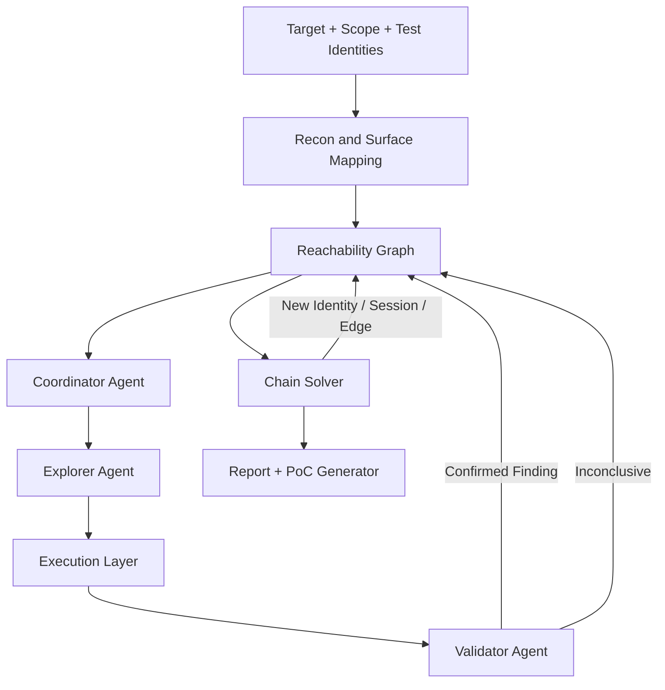

# ReachAgent — Web/API Exploitation Agent
### Final Project Plan (July 2026)

**Status: Locked — v1.5.** Changes from v1.4.1: client-side structural classes (clickjacking, CORS misconfiguration, CSRF) added to §5/§7; the §9 external-scanner rule is formalized into three behavior-defined tiers (recon/transport facts vs. signal-gated exploitation candidate sources vs. transport-aggregator MCPs); public payload corpora (PayloadsAllTheThings, SecLists) named as tagged reference sources in §9/§12; CVE-match added as an evidence type under STRUCTURAL_VERIFICATION (§7); fingerprint_parameter gains context-aware class-prioritization in §13. No seventh oracle family — all new classes route through the existing structural-verification mechanism.

**Status: Locked — v1.4.1.** Changes from v1.4: `fire_browser` added to §13 core manifest as an Explorer-owned browser-side tool for Phase 3 DOM taint-tracking, resolving the open verification question from v1.3.

**Status (v1.4):** Supersedes all prior drafts. Changes from v1.3: tool calling promoted to a first-class design element — §13 now opens with the tool manifest and a full worked trace (fingerprint → sink-matched selection → mutation → oracle verification) instead of leading with MCP servers; role boundaries are now defined by tool access, not just description (§4, §13). External scanners (sqlmap, Nuclei, ZAP, and Burp/Caido's own built-in scanners) are explicitly excluded as core dependencies (§1, §9, §13), with a deferred, optional ingestion mode specified that still requires every imported candidate to pass `run_oracle` before being confirmed.

---

## 1. Positioning

> ReachAgent does not try to out-scan existing tools on single-request vulnerability detection — that space is commoditized. It targets what the field still does poorly: **confirmed, multi-hop attack chains that cross vulnerability classes**, found via a live reachability graph and deterministic verification instead of LLM judgment.

Every rating and design choice below is tied to a specific, cited reason, not a plausibility judgment — because an ungrounded confidence rating in the tool's own coverage claims is the same failure mode the deterministic-verification principle exists to prevent.

**Explicitly out of scope, by design:** C2/post-exploitation tooling and mobile targets. Where a finding confirms code execution (e.g. command injection), the system stops at confirmation — it does not pivot into interactive shell access or persistence.

**Also explicitly out of scope: orchestrating external scanners as the detection mechanism.** sqlmap, Nuclei, ZAP, and similar tools are not shelled out to or wrapped as part of how ReachAgent decides what's vulnerable — see §9 for why, and for the deferred, optional exception.

---

## 2. Core design principles

| Principle | Description |
|---|---|
| **Deterministic verification** | No finding is reported unless a scripted, non-LLM check confirms it. LLM judgment proposes candidates; it never adjudicates them. |
| **Graph-centric** | Every confirmed finding writes structured facts into a shared reachability graph — nothing lives only in a report string. |
| **Multi-class chaining** | Findings across different vulnerability classes connect through one uniform mechanism, not bespoke per-pair logic. |
| **Safety first** | Read-only testing by default, strict scope enforcement, no destructive actions without explicit escalation. |
| **Cost aware** | Expensive reasoning models are reserved for strategy and verification; high-volume execution runs on cheap/fast models. |

---

## 3. High-level architecture



The loop that matters is `C → D → E → F → G → C`: every test result, confirmed or not, writes back into the graph, so coverage is tracked and nothing gets retested. The **Chain Solver** is what turns single findings into attack paths — it runs reachability queries over the graph and, when it finds a finding that produces a new credential or privilege, feeds a new node back into `C`, which reopens the search from that point. This feedback loop is the entire mechanism behind cross-class chaining (§8).

---

## 4. Agent roles

| Role | Responsibility | Model tier |
|---|---|---|
| **Coordinator** | Owns the graph; decides what to test next by querying untested edges and newly spawned nodes; prioritizes chain-completing tests over fresh exploration | Sonnet-tier — needs real reasoning over graph state |
| **Explorer** | Sink fingerprinting, payload selection and firing, raw response classification — highest call volume | Haiku-tier — cheap and fast |
| **Validator** | Independently re-derives confirmation using deterministic oracles only; has no access to or incentive to agree with the Explorer's classification | Sonnet-tier, constrained to pre-defined verification procedures, not open-ended judgment |

**Each role's authority is enforced by which tools it can call, not just by this description.** The Explorer can generate candidates but never confirm them; only the Validator can write a `Finding`. See §13 for the exact tool contracts and why those boundaries are implemented in code, not just stated as policy.

### Coordinator prioritization rule

The Coordinator does not test edges in discovery order. Every untested `(identity, endpoint)` edge is scored, and the Coordinator always pops the highest-scoring edge off a priority queue that gets re-scored whenever the graph changes — a new `Finding`, a new spawned `Identity`/`Session`, or a budget cap tripping on the current path:

```
score = (object_sensitivity_tier × 3)
       + (is_newly_spawned_identity × 5)
       + sink_severity_weight
       − prior_attempts_in_neighborhood
```

- **`object_sensitivity_tier`** (0–3): how sensitive the endpoint's data or action is — 0 public, 1 user-owned, 2 cross-user, 3 admin/system.
- **`is_newly_spawned_identity`** (0/1): whether this identity or session was created by the Chain Solver via a `derived_credential` edge earlier in the current run. Weighted heaviest of all terms — this is what makes the Coordinator finish a chain it just found instead of wandering off to fresh, disconnected exploration.
- **`sink_severity_weight`**: derived from the parameter's `inferred_sink_type` — RCE-adjacent sinks (`shell`, `deserialize_target`) score higher than lower-impact sinks (`html_reflection`).
- **`prior_attempts_in_neighborhood`**: count of already-tested edges within one hop of this one — discourages redundant local exploration once a region of the graph is saturated.

This is what makes "prioritizes chain-completing tests over fresh exploration" a concrete, implementable rule rather than an aspiration.

---

## 5. Vulnerability coverage matrix

Ratings are calibrated against published results and documented technique limitations, not estimated.

| Class | Support | Primary oracle | Basis |
|---|---|---|---|
| BOLA / IDOR | **Full** | Cross-identity differential diff | Core mechanism of the graph design |
| BFLA | **Full** | Cross-identity differential on role-gated actions | Same mechanism applied to actions |
| Business logic — known patterns (limit overrun, workflow-order bypass) | **Partial** | 4-template library: single-use reuse, quantity/limit, price/parameter tamper diff, step-order check | Covers the common pattern set via recon-instantiated templates, not hand-modeled per target |
| Business logic — novel/unprecedented | **Weak** | None generic | No oracle exists for a rule the system was never told |
| SQL Injection (error/boolean) | **Full** | Differential + DB error signature | Deterministic, low-noise |
| SQL Injection (blind) | **Partial** | OOB callback (primary), paired-trial timing with negative control (fallback) | OOB-capable targets approach Full; timing-only remains noisy — matches published 0% baseline for naive timing-only detection |
| NoSQL Injection — auth bypass | **Full** | Operator-injection differential diff | |
| NoSQL Injection — blind/deep extraction | **Partial** | Paired-trial statistical oracle, reused from blind SQLi | Same statistical caveats as blind SQLi |
| Command Injection | **Full** | OOB callback (primary), timing (fallback) | |
| LDAP Injection — auth bypass | **Full** | Wildcard/filter differential diff | |
| LDAP Injection — blind extraction | **Partial** | Paired-trial statistical oracle | No OOB channel exists for this class — ceiling is lower than SQLi's |
| XSS — Reflected | **Full** | Headless browser execution confirmation | Confirms the script *ran*, not just reflected — works regardless of cookie flags |
| XSS — Stored | **Full** | Headless execution confirmation on a triggering second view | |
| XSS — DOM-based | **Partial** | Execution confirmation, fed by Playwright taint-tracking shim (hooks common sinks/sources) | Systematic discovery now, but bounded by a hand-maintained sink/source hook list |
| SSRF (non-blind) | **Full** | Response content confirms internal reachability | |
| SSRF (blind) | **Full** | OOB collaborator callback | |
| SSTI / Template Injection | **Full** | Differential math-expression evaluation | Deterministic, low-noise |
| Mass Assignment | **Full** | Schema diff + independent re-read confirming the effect | |
| Auth & JWT issues (alg confusion, `none`, weak secret, `kid` injection) | **Full** | Structural — forged token grants access or it doesn't | |
| File Upload (type/extension bypass) | **Full** | Retrieval/execution confirmation | |
| Path Traversal | **Full** | Retrieval of known out-of-scope file, content-matched | |
| Race Conditions | **Partial** | Sequential-replay-first, escalating to single-packet concurrent delivery; reuses the business-logic anomaly-check oracle | No fuzzable signature exists for this class — ceiling doesn't move with better engineering, only efficiency does |
| Insecure Deserialization | **Weak** | Canary-object precondition detection only | Gadget-chain generation is a specialized, per-language research problem, not a generic payload-library task |
| GraphQL — resolver-level BOLA | **Full** | Field-level differential oracle | Route-level auth checks often don't propagate to individual resolvers |
| GraphQL — batching/alias auth bypass | **Full** | Deterministic — was the rate limit enforced under batching | |
| GraphQL — introspection/schema recovery | **Full** | Direct query if enabled; field-suggestion inference if disabled | |
| GraphQL — depth/complexity DoS | **Full** | Multi-trial complexity-regression against a measured baseline curve | Self-contained, repeatable measurement — no per-target hardcoded threshold needed |
| Clickjacking | **Full** | Structural — response lacks BOTH `X-Frame-Options` AND CSP `frame-ancestors`, confirmed against a framing-attempt render | Deterministic header check; finding requires both defenses absent, not just one |
| CORS misconfiguration | **Full** | Structural — reflected/permissive `Access-Control-Allow-Origin` **with** `Access-Control-Allow-Credentials: true` | The credentialed-reflection pair is the actual finding; a bare `ACAO: *` without credentials is not written as a violation |
| CSRF (missing protection) | **Partial** | Structural — session cookie is sent cross-site (`SameSite=None`) with no anti-CSRF token mechanism present: the deterministic precondition that leaves the app open to forgery. Header/cookie evidence resolved server-side via `run_oracle` | Confirms a precondition only, not a fired exploit. `SameSite=Lax`/`Strict` or a token present → denied; absent `SameSite` → inconclusive (browsers default to `Lax`, so flagging would overclaim). A confirmed CSRF would require firing a forged cross-origin state-change, which read-only-first (§10) forbids |
| Request smuggling | **Weak** | None generic | CL.TE/TE.CL desync detection is front-end/back-end-pair specific and needs raw socket control the transport layer doesn't expose yet; deferred |
| Web cache poisoning | **Weak** | None generic | Requires modeling an unkeyed-input-to-cache-key relationship per target; no generic oracle. Deferred |
| Multi-hop cross-class chains | **Full — core differentiator** | Chain Solver over `enables` / `derived_credential` edges | See §8 |

---

## 6. Graph data model

The graph has two layers: **structural facts** (what the app actually does) and **finding relationships** (how confirmed vulnerabilities connect to each other). Keeping these separate is what lets chaining stay generic instead of needing bespoke logic for every pair of vulnerability classes.

### Node types

| Node | Key attributes |
|---|---|
| `Identity` | role, auth_state (unauth/user/admin/synthetic), provenance (seeded vs. derived-from-finding) |
| `Session` | token/cookie ref, bound Identity, live/expired status |
| `Endpoint` | method, path, content_type, protocol (REST/GraphQL), graphql_operation_type |
| `Parameter` | name, location, inferred_sink_type (sql/nosql/shell/ldap/template/file_path/deserialize_target/html_reflection/url) |
| `Object` | type, owner_identity_ref, sensitivity_tier |
| `InternalResource` | for SSRF — internal IP ranges, cloud metadata endpoints, OOB collaborator domain |
| `ExecutionContext` | for injection/RCE-class findings — confirms code execution occurred; deliberately not wired to any interactive/post-exploitation tooling |
| `Finding` | vuln_class, severity, oracle_used, evidence_ref, status |

### Structural edges (surface mapping)

| Edge | Meaning |
|---|---|
| `can_call(Identity → Endpoint)` | empirically confirmed authorization |
| `returns(Endpoint → Object)` | what an endpoint exposes |
| `owns(Identity → Object)` | intended ownership per app-declared roles |
| `accepts(Endpoint → Parameter)` | endpoint's input surface |
| `reaches(Endpoint → InternalResource)` | SSRF-relevant outbound reachability |
| `authenticates_as(Session → Identity)` | which identity a session currently represents |

### Finding-relationship edges (chain mechanism)

| Edge | Meaning |
|---|---|
| `enables(Finding → Finding)` | finding A's output makes finding B possible — the chain edge |
| `derived_credential(Finding → Session \| Identity)` | a finding that yields a usable session or credential spawns a new node the Coordinator treats as first-class |

Every `can_call` and `Finding` edge carries a status: `confirmed_allowed`, `confirmed_denied`, `confirmed_violation`, or `inconclusive`.

---

## 7. Detection and verification strategy

Still six oracle mechanisms — four of them generalized in v1.2 to absorb previously-weak classes, not a new count. This is what keeps the Validator generic instead of needing a bespoke checker per class:

| Mechanism | Classes it covers |
|---|---|
| **Differential cross-identity/cross-request/cross-condition diff** | BOLA, BFLA, GraphQL resolver BOLA, mass assignment, boolean-blind SQLi, NoSQLi (both sub-cases), LDAP (both sub-cases), business-logic price/parameter tampering |
| **Evaluation/execution confirmation** | SSTI (expression evaluated), XSS reflected/stored/DOM — DOM now fed by a Playwright taint-tracking shim that hooks common sinks (`innerHTML`, `document.write`, `eval`, `location`) and sources (`location.hash`, `postMessage`) to discover candidate flows systematically instead of only confirming guessed ones |
| **Out-of-band callback** | Blind SSRF, command injection, OOB-first blind SQLi (tried before falling back to timing) |
| **Timing/statistical (generalized)** | Time-based blind SQLi/NoSQLi/LDAP, always paired against a negative-control trial to rule out network jitter; GraphQL complexity regression (latency measured as a function of query depth, fit against a baseline curve rather than a hardcoded threshold) |
| **Structural verification** | JWT forgeries, file upload/path traversal (retrieved content matched against a known artifact), clickjacking (both framing defenses absent), CORS misconfiguration (credentialed ACAO reflection), CSRF missing-protection (`SameSite=None` cross-site cookie + no anti-CSRF token — a structural precondition, no forged state-change fired); also CVE-match evidence — a fingerprinted version matched against a known-vulnerable range is treated as structural evidence, still confirmed by this family, never self-reported |
| **Business-rule / invariant anomaly check** | Known business-logic patterns via a 4-template library (single-use reuse, quantity/limit, price tamper, step-order) run as cheap sequential replay; race conditions reuse the *same* anomaly check, escalated to single-packet concurrent delivery only when sequential replay finds nothing — the graph must first identify a consumable/limited resource before this technique is worth pointing at it, and it remains lower-priority than the other five |

**Rule, unconditionally:** the LLM can propose a candidate; only a Validator-run deterministic check produces a `Finding` node.

---

## 8. Multi-hop, cross-class chain discovery

**Mechanism:** any finding that yields a new credential, elevates an identity's effective privilege, or produces attacker-controlled content another principal will render or execute spawns a new `Session`/`Identity` node or a new edge, and the Chain Solver re-runs reachability queries from that point.

**Worked example — the chain from §1's positioning claim:**

```
Low-privilege identity
  → confirmed Stored XSS finding (payload targets an admin-viewed field)
  → Playwright oracle confirms execution in the admin's session context
  → derived_credential edge spawns a new Session node bound to the admin Identity
  → Coordinator re-queries can_call edges for that session
  → discovers an admin-only endpoint that itself has an SSRF-vulnerable parameter
  → confirmed SSRF reaches an internal service via reaches edge
  → enables edge links the XSS Finding to the SSRF Finding
  → Report: one connected chain, not two disconnected low/high-severity bugs
```

Other examples: mass assignment that privilege-escalates the *acting identity itself* (no new node needed — the Coordinator just re-tests that identity's existing `can_call` edges); a confirmed SSRF reaching cloud metadata that yields a usable token (`derived_credential` into a new synthetic `Identity`, tested against internal-only endpoints).

This uniform spawn-and-requery mechanism is the actual differentiator versus every siloed, single-class scanner in the current landscape.

---

## 9. Payload strategy

**Custom, tagged payloads remain a core strength of the system.** ReachAgent's own payload library and its own deterministic oracles are the system of record for what counts as a confirmed finding — nothing is delegated to an external scanner's judgment (see below). The library may be seeded from public payload corpora — PayloadsAllTheThings, SecLists, and similar — as *reference payloads only*: each imported entry is tagged with `vuln_class` / `inferred_sink_type` / `oracle_type` on ingest, and an untagged payload is not loadable. These corpora expand the payload set; they never expand what counts as confirmed — every payload, imported or hand-written, still routes through `run_oracle`.

### The pipeline as actual tool calls

Fingerprinting, sink matching, selection, mutation, and verification aren't abstract steps — each is a named tool call from the §13 manifest, which is what makes the pipeline auditable end to end rather than a description of LLM vibes:

1. **Fingerprint** — `fingerprint_parameter(endpoint, param)`. The Explorer sends a benign canary first and reads reflection behavior, error signatures, and response content-type. This sets `inferred_sink_type` on the `Parameter` node (`sql`, `nosql`, `shell`, `ldap`, `template`, `file_path`, `deserialize_target`, `html_reflection`, `url`, ...). Nothing downstream fires before this completes.
2. **Sink-matched selection** — `get_payloads(vuln_class, sink_type)`. Returns only the tagged entries relevant to the inferred sink, ordered by oracle confidence (§7) — OOB-capable entries before pure-timing ones for injection classes, cheap sequential-replay before expensive concurrent delivery for business-logic/race classes. A parameter fingerprinted as `html_reflection` is never handed a SQLi payload, and vice versa.
3. **Light, context-aware mutation** — inside the `get_payloads` → `fire_request(identity, endpoint, payload)` cycle. If a base entry is blocked (a WAF signature match, an unexpected sanitization pattern surfaced during fingerprinting), the Explorer may generate a small variant — always a transformation of a library-anchored entry, never invented from scratch — carrying its parent's `vuln_class`/`sink_type`/`oracle_type` tags forward so it still routes to the correct oracle.
4. **Deterministic verification** — `run_oracle(mechanism, evidence)`, called by the Validator, never the Explorer. Only a `confirmed` result from one of the six families in §7 unlocks `write_finding`, the only tool that commits a `Finding` node.

A full worked trace of this sequence across all three roles is in §13.

Payload library schema:
```
{vuln_class, context, inferred_sink_type, oracle_type, payload_ref, graph_edge_on_success}
```
Sourced and restructured from PayloadsAllTheThings, OWASP WSTG, and PortSwigger Academy. The system's value is in the tagging, sink-matching, and oracle wiring — not in reinventing payload strings.

**Not every class is payload-library-driven.** Business-logic templates and race conditions are request-*sequencing* and *timing-delivery* tests — they skip `get_payloads` entirely. Blind SQLi, NoSQLi, and LDAP extraction share one paired-trial mechanism (a real payload plus a negative control, repeated N times) rather than separate per-class logic.

### External scanners: explicitly not a core dependency

sqlmap, Nuclei, ZAP, Burp Scanner, Caido's Scanner, and similar tools are not shelled out to, wrapped, or orchestrated as part of detection, in any phase through Phase 7:

- Their detection logic is a black box to the graph — a finding from an external scanner can't be traced back to a specific `run_oracle` mechanism, breaking the invariant that every `Finding` node carries its own confirming evidence.
- Template/signature-based scanners (Nuclei especially) are known to produce false positives against custom application logic — reintroducing exactly the noise the deterministic-verification principle exists to eliminate, just from a different source than an LLM.
- It would blur what ReachAgent actually contributes: the tagged-payload-plus-deterministic-oracle pipeline and the graph built on it, not an aggregation of other tools' output.

**Deferred, optional: an ingestion mode.** A future mode could import external-scanner findings as *candidates* — the same unverified status an Explorer-discovered lead has, never a pre-confirmed `Finding`. An imported candidate still has to pass through `run_oracle` before it's written as `confirmed_violation`, exactly like anything ReachAgent found on its own. Not scheduled in §15; revisit only after Phase 7.

### Tool-orchestration tiers

The external tool universe is large and growing (hundreds of recon, scanner, exploitation, and AI-agent tools). We do not maintain a whitelist. Instead every tool is placed by **what its output is** — a fact, a claim, or a transport — into exactly one of three tiers. None of the three can produce a `Finding`:

| Tier | Output is | Examples (non-exhaustive) | Role in the graph |
|---|---|---|---|
| Recon / transport | A **fact** (endpoint, param, subdomain, detected version) | Nmap, ffuf, feroxbuster, subfinder, httpx, katana, wappalyzer, theHarvester, Amass | Emitted as transport-tier graph nodes/edges — never a candidate, never a finding |
| Signal-gated exploitation | A **claim** of a vulnerability | sqlmap, Nuclei, Wapiti, Arachni, Metasploit modules, wpscan (active), PentestGPT-style agents | Invoked only as a candidate *source*, and only once the graph already holds a signal for that class; output is an unverified candidate that still passes `run_oracle`. Never self-reports a confirmed finding |
| Transport aggregator | A **transport** (carries requests/responses) | HexStrike, Burp/Caido MCP, any multi-tool MCP | A fire transport, not a detector. Built-in scanners stay off (§13) |

The tier is decided by the nature of a tool's output, not by its name — any current or future recon/scanner/exploitation tool maps to exactly one tier by this test. A tool that both recons and exploits (increasingly, one autonomous agent does both) is split by output: its facts enter the recon tier, its claims the signal-gated tier. Nothing from any tier is written as `confirmed` without passing ReachAgent's own `run_oracle`. This is the §9 invariant restated at the orchestration boundary, not a loophole around it.

---

## 10. Safety controls

- Strict **scope allowlist**, enforced at the execution layer at call time — not just documented policy
- **Read-only-first**: no state-changing request fires until the read-only case is confirmed safe
- Idempotency/rollback awareness for any test that must hit a mutating endpoint
- Rate limiting and stealth **off by default**, opt-in only
- No destructive actions without explicit escalation
- Isolated session/token store per test identity
- Full, clear logging of every action taken, for audit and reproducibility

---

## 11. Cost controls

- Per-test-path budget cap (~40 tool calls or a fixed $ ceiling) before the Coordinator abandons a path as a dead end — resource consumption correlates negatively with success in published multi-agent pentest results, so this doubles as a stopping heuristic, not just a cost saver
- Prompt caching for recurring context (target fingerprint, graph state, payload library slices)
- High-volume, low-judgment calls routed to the cheapest reliable model; reasoning-tier calls reserved for Coordinator strategy and Validator confirmation

---

## 12. Recommended tech stack

| Layer | Technology |
|---|---|
| Orchestration | Claude API tool use (three-role split); LangGraph is a reasonable orchestration substrate if you want explicit state machines around the agent loop |
| Graph store | NetworkX in-process for Phases 1–2 (fast to iterate); Neo4j once the finding-relationship layer and chain queries are the bottleneck — Cypher fits `enables`/`derived_credential` traversal naturally |
| Execution | HTTPX for request firing, Playwright for browser-context oracles (XSS confirmation, DOM sinks) |
| Proxy | mitmproxy or Caido for capture/replay |
| OOB/collaborator | Self-hosted interact.sh instance |
| Race-condition module | HTTP/2 single-packet delivery (Turbo Intruder's published technique, reimplemented or shelled out to) |
| Payload store | YAML for Phase 1, SQLite once lookups by `(vuln_class, inferred_sink_type)` need indexing; seeded from tagged public corpora (PayloadsAllTheThings, SecLists) plus custom entries — every entry tagged on ingest |
| Reporting | Markdown + JSON for machine-readable chain data, optional HTML render for human review |

---

## 13. Tool-calling architecture

Tool calling is not an implementation detail sitting underneath the three agent roles — it's how those roles are actually defined and bounded. Every capability in §4 through §9 exists as a named tool call, not free-form model behavior.

### Core tool manifest

| Role | Tool | Purpose |
|---|---|---|
| Explorer | `fingerprint_parameter(endpoint, param)` | Sends canary values, sets `inferred_sink_type`; context-aware class-prioritization — the LLM may propose the likely class to probe first, but the oracle still confirms |
| Explorer | `get_payloads(vuln_class, sink_type)` | Sink-matched lookup from the tagged payload library, ordered by oracle confidence |
| Explorer | `fire_request(identity, endpoint, payload)` | Executes an HTTP request via the HTTP client / Burp-or-Caido MCP proxy; returns a network fire handle |
| Explorer | `fire_browser(identity, url, inject_shim=True)` | Drives a Playwright browser context: navigates `url`, installs the §7 DOM taint-tracking shim via `addInitScript` before load, returns a browser fire handle carrying captured taint events. Browser-side transport — distinct from `fire_request`'s network-side transport, not a flag on it. Explorer-owned, same boundary as `fire_request`; the taint evidence it captures is consumed by `run_oracle`'s execution-confirmation family (Validator), never confirmed by the Explorer |
| Explorer | `classify_response(response)` | Raw signal extraction — status, length, error strings; produces a candidate handoff, never a confirmation |
| Coordinator | `query_graph(filter)` | Pulls untested edges, recent findings, spawned identities |
| Coordinator | `score_and_select(candidates)` | Applies the §4 scoring rule, returns the next test |
| Coordinator | `check_budget(path_id)` | Enforces the per-path budget cap (§11) |
| Validator | `run_oracle(mechanism, evidence)` | Executes one of the six deterministic families (§7) — the only tool that can produce a `confirmed` result |
| Validator | `write_finding(finding)` | Commits a `Finding` node — gated entirely behind a `confirmed` result from `run_oracle` |
| Validator | `mark_inconclusive(edge)` | Writes back a negative result so the edge isn't retested |

**Tool access is role-bounded, not just role-described.** The Explorer can call `fire_request` and `fire_browser` but never `write_finding` — it generates candidates, not confirmations. The Coordinator never calls `fire_request` or `run_oracle` directly — only `query_graph`, `score_and_select`, and `check_budget`. Only the Validator can call `run_oracle` and `write_finding`. Implemented as separate tool subsets per role, this is what makes "only a deterministic check can produce a finding" enforceable in code, not just stated as a principle.

### Worked trace — one test, start to finish

```
1.  Coordinator  query_graph(filter: untested edges for identity=user_b)
2.  Coordinator  score_and_select(candidates) → (user_b, /orders/{id}, param=id)
3.  Coordinator  check_budget(path_id) → cleared
4.  Explorer     fingerprint_parameter(/orders/{id}, id) → inferred_sink_type=sql
5.  Explorer     get_payloads(vuln_class=sqli_blind, sink_type=sql) → OOB-capable entries first
6.  Explorer     fire_request(user_b, /orders/{id}, oob_payload) → no callback
7.  Explorer     fire_request(user_b, /orders/{id}, timing_payload) → WAF block observed
8.  Explorer     [light mutation of timing_payload, same tags carried forward]
9.  Explorer     fire_request(...) × N trials + negative control
10. Explorer     classify_response(...) → candidate, timing delta above baseline
11. Explorer →   Validator: candidate handoff
12. Validator    run_oracle(mechanism=timing_statistical, evidence=trials+control) → confirmed
13. Validator    write_finding({vuln_class: sqli_blind, oracle_used: timing_statistical, ...})
14. Graph        edge status → confirmed_violation; Chain Solver re-queries from updated state
```

Every line is a tool call or a direct consequence of one — there's no step where "the LLM just decided it looked vulnerable."

### Supporting MCP integrations

Infrastructure ReachAgent consumes to *implement* the tools above — not a replacement for them, and not a detection mechanism in their own right. Burp's and Caido's own built-in scanners specifically are not used (§9):

| Component | MCP server | Backs which tool |
|---|---|---|
| Browser oracle (XSS execution confirmation, DOM taint-tracking) | **Playwright MCP** — Microsoft's official `@playwright/mcp`, 40+ tools via accessibility-tree snapshots | `fire_browser` (the dedicated browser fire tool, added to the core manifest above for Phase 3 — `fire_request` stays network-side only), and `run_oracle`'s execution-confirmation family. The §7 taint-tracking shim is installed by `fire_browser` via `addInitScript`; this resolves the v1.3 open question of whether the browser integration exposed a sufficient script-injection path |
| Proxy / traffic capture and replay | **Burp Suite MCP Server** (PortSwigger's official extension) or **Caido's MCP integration** — capture/replay only | `fire_request`. Vendor-maintained, the right trust bar for something in the request path |
| Graph store queries (Phase 2+, once past NetworkX) | **Neo4j MCP** — official `neo4j/mcp` | `query_graph`, `write_finding`, `mark_inconclusive` |

### Expose ReachAgent's own tools as an MCP server

Build the manifest above as actual MCP tools starting in Phase 1, not only as internal functions the Coordinator calls once it exists. Before the §4 scoring rule is built, the same tools can be driven by hand from Claude Desktop or Claude Code — a faster debug loop — and nothing changes when the autonomous Coordinator takes over in Phase 5, since it calls the identical tool contracts a human was using.

### Other integrations — scoped honestly

- **Notification webhook** on any `confirmed_violation` above a severity threshold — optional, fits once the Coordinator exists in Phase 5
- **Ticketing/reporting** (GitHub Issues, Jira) — deferred; Markdown/JSON reporting is sufficient through Phase 7
- **CI/CD triggering** — out of scope, same treatment as the C2/mobile exclusions in §1
- **External scanner ingestion** (sqlmap, Nuclei, ZAP) — deferred and optional per §9, not a Phase 1–7 dependency
- **Recon-tier tool MCPs** (any fact-emitting tool: ffuf/feroxbuster/subfinder/wappalyzer/…) — optional, feed transport-tier structural facts only, per the §9 tier rule; never a detection dependency
- **Signal-gated exploitation-tier tools** (any claim-emitting tool: sqlmap/Nuclei/wpscan-active/…) — optional candidate sources gated on an existing graph signal, output still passes `run_oracle`; deferred, same treatment as external-scanner ingestion in §9
- **Secrets management** for test-identity credentials — environment-based or a local secrets store, never hardcoded, consistent with §10

---

## 14. Evaluation plan

| Target | Validates |
|---|---|
| **VAmPI** | Baseline BOLA/IDOR/mass assignment/JWT precision-recall — ships with a built-in vulnerable/not-vulnerable toggle purpose-built for measuring false positive/negative rate against ground truth. **Numeric gate: ≥90% precision and ≥80% recall with the toggle on; zero confirmed findings with the toggle off.** |
| **crAPI** | Stateful, multi-step BOLA and business-logic chains, plus an SSRF-relevant flow — validates the graph catches cross-flow object reuse. **Numeric gate: 100% of crAPI's documented multi-step BOLA scenarios (vehicle-location and mechanic-contact chains) reconstructed end-to-end, with zero destructive side effects logged during the run.** |
| **OWASP Juice Shop** | Broadest single-target coverage: XSS (all three variants), SQLi, file upload, path traversal, broken auth — built-in challenge tracker gives ground truth |
| **PortSwigger Web Security Academy — blind SQLi labs** | Dedicated ground truth for the OOB-first/paired-timing blind SQLi oracle specifically, since Juice Shop doesn't cleanly isolate the blind case |
| **DVGA** | Dedicated GraphQL ground truth — introspection, batching, resolver BOLA, depth/complexity |
| **PortSwigger Web Security Academy race-condition labs** | Purpose-built ground truth for the single-packet module specifically |
| **Authorized real-world target** | Only after documented precision/recall on all five above, with written scope |

---

## 15. Build roadmap

| Phase | Weeks | Scope | Exit criteria |
|---|---|---|---|
| **1 — Foundation** | 1–3 | Project structure, identity/session management, recon, differential-diff oracle, deterministic verification engine, **Explorer/Validator tools built as MCP tools from the start (§13)** for human-in-the-loop testing via Claude Desktop/Code. Target: VAmPI. | ≥90% precision, ≥80% recall with VAmPI's toggle on; **zero** confirmed findings with the toggle off |
| **2 — Graph + stateful chains** | 4–6 | Live graph (structural layer, NetworkX; migrate to Neo4j MCP once chain queries are the bottleneck), crAPI target, multi-step BOLA, business-logic **4-template invariant library** (single-use reuse, quantity/limit, price tamper, step-order) instantiated from recon-discovered resources | 100% of crAPI's documented multi-step BOLA scenarios reconstructed end-to-end via template match, not hand-coded per-scenario logic; zero destructive side effects logged |
| **3 — Full class coverage** | 7–9 | OOB and paired-trial statistical oracle families (blind SQLi OOB-first + negative-control timing; NoSQLi and LDAP extraction reuse the same statistical harness); Playwright taint-tracking shim for DOM XSS; file upload/path traversal. Target: Juice Shop + PortSwigger Academy blind-SQLi labs. | ≥75% of Juice Shop's injection/XSS/file-upload/path-traversal challenge-tracker items solved; false-positive rate ≤10% against confirmed challenge completions; confirmed blind-SQLi finding on PortSwigger's labs with zero false positives on the labs' non-vulnerable variants |
| **4 — GraphQL module** | 10 | Schema introspection + field-suggestion fallback, resolver-level differential testing, batching probes, **complexity-regression methodology for depth/complexity DoS** | All DVGA resolver-level BOLA and batching-bypass challenges confirmed; zero false positives on intentionally-public fields; DoS finding confirmed only via multi-trial regression against baseline, zero false positives under repeated baseline-only trials |
| **5 — Agent system + chain solver** | 11–13 | Coordinator/Explorer/Validator split, scoring-rule prioritization live (§4), `enables`/`derived_credential` mechanism live, cost controls, budget caps, prompt caching | At least one full multi-hop cross-class chain (e.g. the §8 XSS→SSRF example) reconstructed end-to-end on a mixed-vulnerability target; average cost per test path stays within the ~40-tool-call / fixed-$ budget cap |
| **6 — Race-condition module** | 14 | Sequential-replay-first escalation (reuses Phase 2's business-logic anomaly-check oracle), single-packet concurrent delivery only when replay alone finds nothing. Target: PortSwigger labs. Scoped as secondary/lower-priority per §7. | Confirmed exploit reproduced on each assigned PortSwigger Academy race-condition lab, matching that lab's documented intended outcome |
| **7 — Hardening + real-world** | 15–16 | Full evaluation re-run across all five test targets, reporting system, safety hardening, authorized real target with written scope | All Phase 1–6 gates re-passed simultaneously in one consolidated run, before authorization to test a real target |

---

## 16. Realistic limitations

- Will not find every possible vulnerability — strongest against known patterns applied systematically and chains built from them, not novel classes with no existing oracle
- Blind SQLi and DOM-based XSS remain statistically weaker for LLM-driven agents industry-wide; budget extra oracle investment here, don't assume solved
- Race conditions and deserialization exploitation are explicitly partial/weak — see §5 for why, not just that
- Quality is bounded by payload library breadth and oracle design quality, not by model capability alone
- Multi-hop chains built from known-class findings are more reliable than discovering genuinely novel, unprecedented business logic flaws
- Best results require multiple test identities across the real role hierarchy — this is a grey-box, bug-bounty-style tool, not a fully black-box one
- Coverage cost scales roughly with identities × endpoints × parameters; budget caps are load-bearing as target size grows, not optional
- Deliberately conservative: because findings require deterministic confirmation, the system under-reports ambiguous cases rather than over-reports them — a tradeoff, not an oversight

---

## 17. Open questions before writing code

- Test identity provisioning strategy per target (manual seeding vs. self-registration where available)
- Confirmed-chain output format — replay script, Postman collection, or both — and how much of the `enables` chain to surface in the human-readable report vs. keep as raw graph data
- How aggressively the race-condition module should attempt automatic limit identification vs. requiring it flagged per engagement
